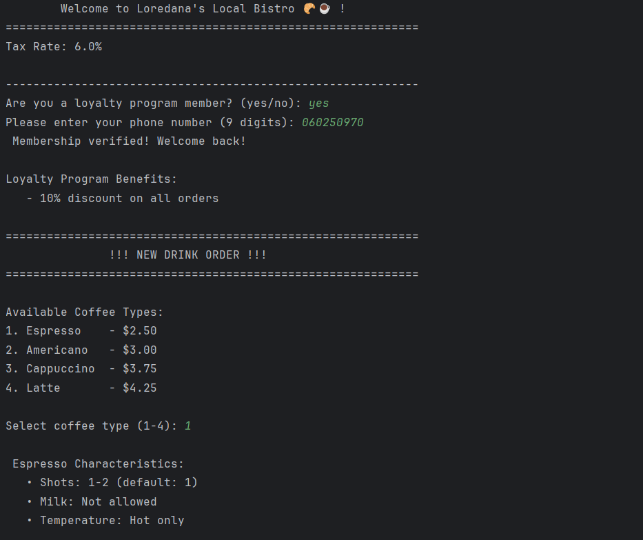
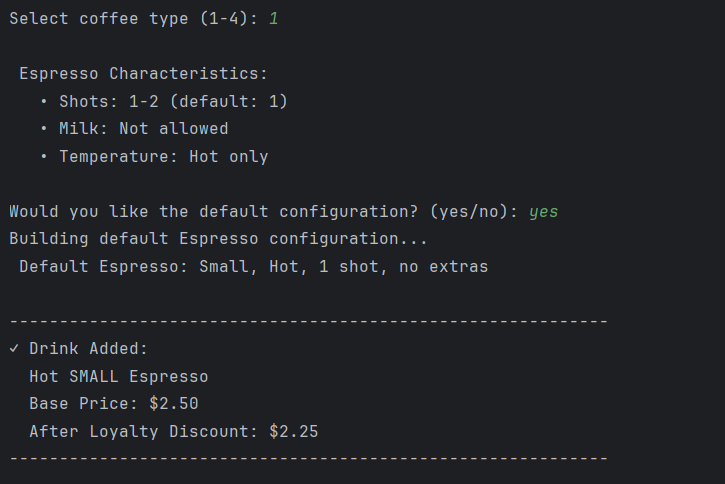
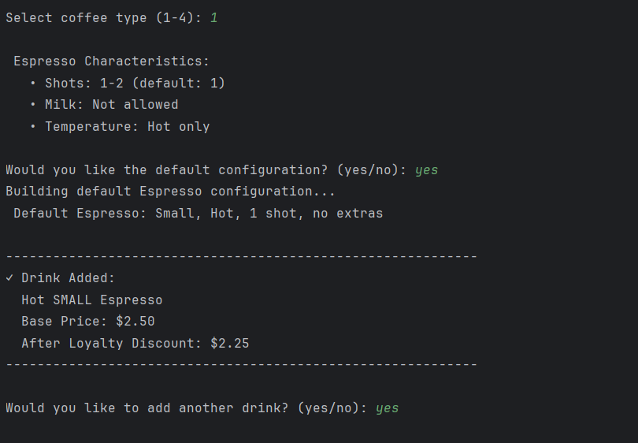
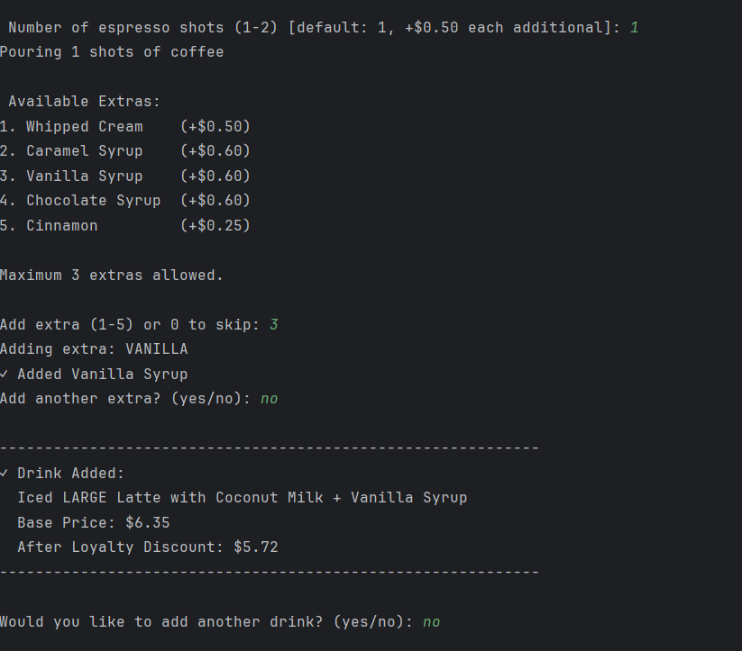
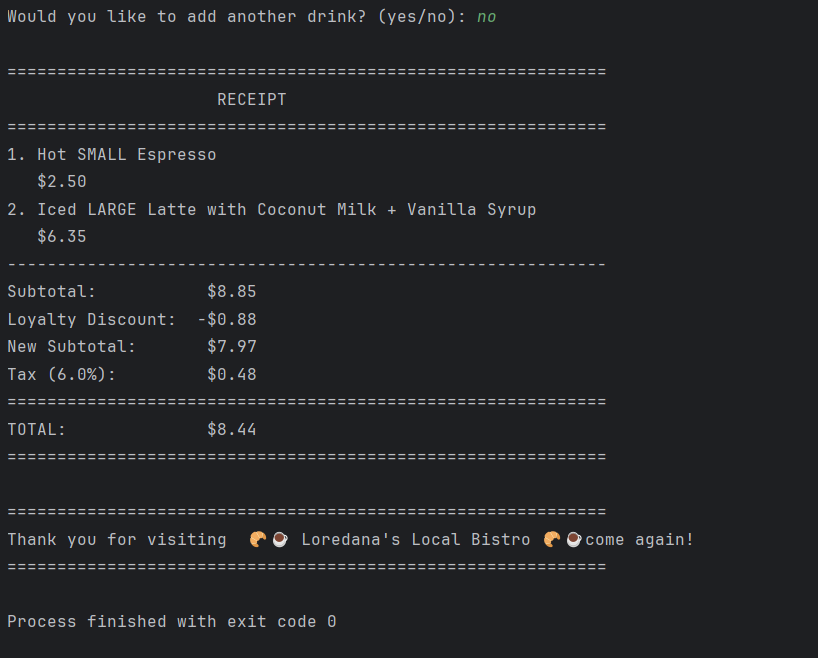

# Creational Design Patterns, Local Bistro 🥐☕ 


## Author: Condrea Loredana, Group FAF-231

----

## Objectives:

* Become familiar with Creational Design Patterns;
* Select a specific application domain;
* Implement at least three Creational DPs within the chosen domain


## Applied Design Patterns:

* **Singleton** - Guarantees that a class has only one instance and provides a global access point to it.
* **Builder** - Separates the construction of a complex object from its final form, allowing it to be assembled gradually.
* **Factory Method** - Defines an interface for object creation while letting subclasses determine which concrete product is instantiated.


## Implementation

* This project implements a realistic **coffee shop** ordering system where customers can order customized beverages through an interactive terminal interface. The system enforces authentic coffee preparation rules (ex: *Espresso* cannot have milk, *Cappuccino* requires milk, *Americano* defaults to 2 shots) while managing a loyalty program with membership verification and discounts.
* The three creational patterns complement each other, each addressing a different aspect of object creation. The Singleton manages global configuration and loyalty data, the Factory Method produces various coffee types based on user input, and the Builder constructs complex, customizable drinks while validating constraints.

### Singleton
The `CoffeeShopConfig` class implements the **Singleton** pattern to ensure that the application works with a single configuration instance throughout its lifetime. This instance stores values such as the tax rate, the loyalty discount, and other shared settings. The constructor is private, and access is provided through a thread-safe getInstance() method, ensuring consistent configuration across all components—whether it's the main program logic or builders that rely on global settings.

```java
private static CoffeeShopConfig instance;  // only one instance

private CoffeeShopConfig() {               // private constructor
    this.taxRate = 0.08;
    this.loyaltyDiscount = 0.10;
}

public static CoffeeShopConfig getInstance() {
    if (instance == null) {
        synchronized (CoffeeShopConfig.class) {
            if (instance == null) instance = new CoffeeShopConfig();
        }
    }
    return instance;
}
```

### Factory Method
The **Factory Method** pattern appears through the `CoffeeFactory`, which defines two factory methods: 
`createCoffee()` - produces a concrete coffee object 
`getDefaultBuilder()` - returns a default, preconfigured builder for that coffee type
Each class that implements the interface (such as `AmericanoFactory`, `EspressoFactory`, `LatteFactory`, `CappuccinoFactory`) overrides these methods to return their specific coffee type and corresponding default builder.This abstraction allows the client code to dynamically select coffee types and building strategies without directly instantiating concrete classes like new Americano() or new Latte(). 

```java
public interface CoffeeFactory {
    Coffee createCoffee();
    Builder getDefaultBuilder();
}
```

```java
public class EspressoFactory implements CoffeeFactory {
    @Override
    public Coffee createCoffee() {
        return new Espresso();
    }
    @Override
    public Builder getDefaultBuilder() {
        return new DefaultEspressoBuilder();
    }
}
```
### Builder
The `Builder` pattern is implemented through a general builder interface along with two construction strategies:

*`Default builders` – provide standard recipes for classic coffee drinks

*`Customizable builder` – allows customers to personalize their drink step-by-step

The `Builder` interface ensures that all builders share a consistent contract:


```java
package domain.builder;

import domain.models.Coffee;

public interface Builder{
    Coffee build();
}
```
For users who want personalization, the `CoffeeBuilder` class offers chainable methods (`withSize()`, `withMilkType()`, `addExtra()`, `makeIced()`, `withShots()`) that allow flexible configuration while automatically validating constraints such as milk requirements, shot limits, and temperature options based on the coffee type.This approach separates the construction logic from the product representation, keeping client code clean and providing both convenience (default configurations) and flexibility (full customization). The pattern validates all configurations before building, ensuring only valid coffee objects are created.
```java
 @Override
    public Coffee build() {
        coffee.setSize(size);

        // Ensure milk requirement is met
        if (coffee.requiresMilk() && milkType == null) {
            System.out.println("!!! " + coffee.getName() + " requires milk. Using default Whole Milk.");
            milkType = MilkType.WHOLE;
        }

        coffee.setMilkType(milkType);
        coffee.setExtras(extras);
        coffee.setShots(shots);
        coffee.setIced(iced);

        if (!coffee.isValidConfiguration()) {
            throw new IllegalStateException("Invalid coffee configuration");
        }

        coffee.calculatePrice();
        return coffee;
    }
```
## Results
In the initial interface, the system displays a welcome message, shows the current tax rate, and asks whether the user is already part of the loyalty program. If not, the user is invited to join. After entering my phone number, I received a confirmation message. The coffee menu appeared next, and I chose an Americano without the default configuration.


Later, the system prompted me to add another drink, and I selected a default configurated Espresso.




A summary of the drink was displayed, including base price and loyalty discount.


Then, the program asked if i wanted to add a new drink, to which i added a customized latte.




Lastly, as my order is complete, the program will generate me the receipt.



## Conclusions
This project shows how combining the Singleton, Factory Method, and Builder patterns leads to a flexible and well-structured system for object creation. Each pattern fulfills a distinct responsibility:

* **Singleton** maintains shared configuration and global program state

* **Factory Method** handles polymorphic creation of coffee types

* **Builder** manages detailed, step-by-step drink customization

Together, these patterns produce a scalable, maintainable architecture that cleanly separates concerns and makes the coffee-shop system easy to extend with new drink types or customization options in the future.