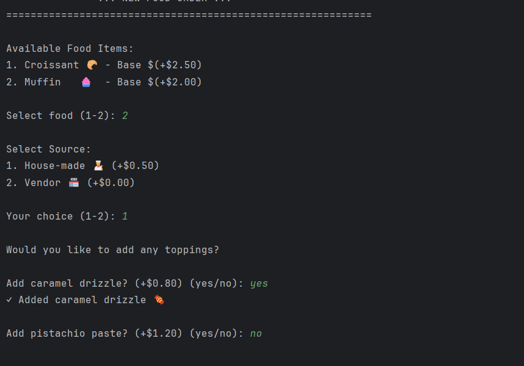
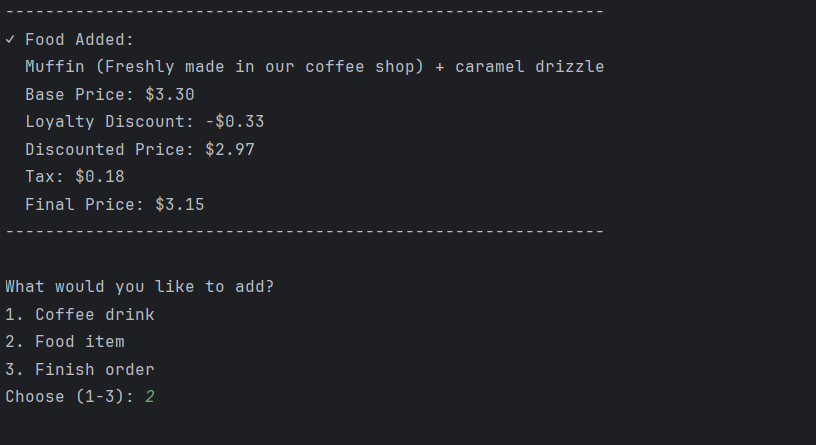
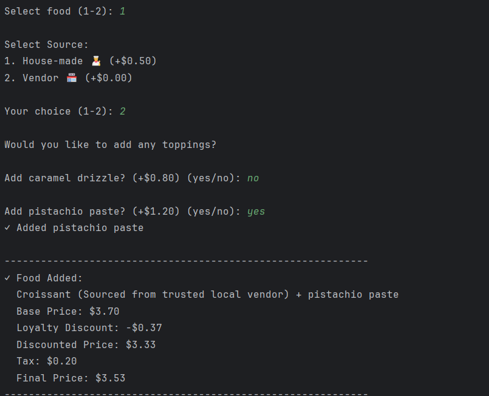
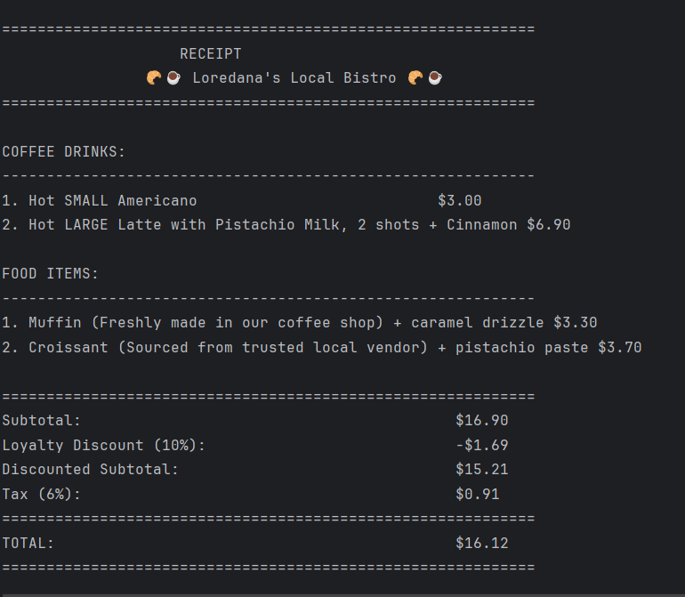

# Structural Design Patterns, Local Bistro 🥐☕


## Author: Condrea Loredana, Group FAF-231

----

## Objectives:

1. Understand the core principles of Structural Design Patterns.
2. Extend the previously built coffee shop system with new features for the end user.
3. Integrate and demonstrate at least three structural design patterns in a practical context.

## Used Design Patterns:
Structural Design Patterns describe how classes and objects can be combined to form larger, more powerful structures. Class-based structural patterns rely on inheritance, while object-based patterns focus on composition, which generally offers more flexibility.

The patterns implemented in this lab are:

- **Facade** – Offers a simplified interface for a complicated subsystem, allowing the client to interact with multiple components without dealing with their internal details.
- **Bridge** – Decouples an abstraction from its implementation so both parts can evolve independently, preventing the creation of a rigid and bloated class hierarchy.
- **Decorator** – Wraps an object to extend its behavior dynamically, adding new functionality without modifying the original class.

## Implementation

This laboratory work extends the previous coffee shop ordering system by adding food items (croissants and muffins) with topping decorators and implementing three structural design patterns: Facade, Bridge, and Decorator. The system now allows customers to order both beverages and food items through an enhanced interactive terminal interface managed by the OrderFacade.

### Facade
The `OrderFacade` class implements the **Facade** pattern by providing a simplified, unified interface to the complex coffee and food ordering subsystem. It hides the complexity of creating coffee objects, food sources, applying decorators, and managing the ordering process from the client code (`UserInterface`).

The client simply calls orderFacade.calculateFinalPrice(price) and receives the result without direct dependency on the configuration subsystem. The facade acts as an intermediary, decoupling the UI from the singleton pattern implementation and tax calculation logic.
```java
public double[] calculateFinalPrice(double price) {
    return config.calculateFinalPrice(price);
}
```

### Bridge

The **Bridge** pattern separates the food item abstraction (`Food` interface implemented by `Croissant` and `Muffin`) from its sourcing implementation (`FoodSource` interface implemented by `HouseMadeSource` and `VendorSource`). This allows food types and sourcing methods to vary independently without creating a rigid class hierarchy.

```java
public class Croissant implements Food {
    private final FoodSource source;

    public Croissant(FoodSource source) {
        this.source = source;
    }

    @Override
    public String getDescription() {
        return "Croissant (" + source.getSourceName() + ")";
    }

    @Override
    public double getFinalPrice() {
        return getBasePrice() + source.getAdditionalCost();
    }
}

```

The bridge connection is established through aggregation, each food item holds a reference to a `FoodSource` object. This design enables flexible combinations: any food item can work with any source (house-made or vendor), and new food types or sources can be added independently without modifying existing code.

### Decorator
The **Decorator** pattern dynamically adds responsibilities to food objects by wrapping them in decorator objects. The `FoodDecorator` abstract class implements the `Food` interface and maintains a reference to a wrapped `Food` object.

Concrete decorators like CaramelSauceDecorator and PistachioPasteDecorator extend FoodDecorator to add specific toppings, modifying the description and price without changing the base food classes.

```java
public class CaramelSauceDecorator extends FoodDecorator {
    public static final double CARAMEL_PRICE = 0.80;

    public CaramelSauceDecorator(Food food) {
        super(food);
    }

    @Override
    public String getDescription() {
        return wrappedFood.getDescription() + " + Caramel Drizzle";
    }

    @Override
    public double getFinalPrice() {
        return wrappedFood.getFinalPrice() + CARAMEL_PRICE;
    }

    @Override
    public double getBasePrice() {
        return CARAMEL_PRICE;
    }
}

```
## Results
The program welcomes the user with the shop name and displays the current tax rate (6.0%). The loyalty program is presented, offering a 10% discount on all orders. When the user confirms that they are already in the program, they enter their phone number (xxxxxxxxx - 9 digits), that is checked if its stored in the system.


After that, the coffee menu is displayed with four types and their base prices. The user selected  *Americano* and chose the default configuration. The system shows the Americano's characteristics and calculates the final price with loyalty discount applied and tax, resulting in 2.86 total.


The user added then a custom *Latte* to the order. The system displays Latte characteristics (base price 4.25, requires milk, can be hot or iced). The user selected a  Large size (+ 1.00), Pistachio Milk (+ 0.90), makes it hot, and requests 2 shots (1 additional shot for +0.50).


The user added Cinammon (+ 0.25) as an extra. The system provides a detailed summary: "Hot LARGE Latte with Pistachio Milk, 2 shots + Cinammon" with base price 6.90, loyalty discount - 0.69, discounted price 6.21, tax 0.37, and final price - 6.58.


The user added then a *Muffin*, choosing the House-made source (+ 0.50). When prompted for toppings, they select caramel drizzle (+ 0.80), demonstrating the Decorator pattern. The food item shows as "Muffin (Freshly made in our coffee shop) + caramel drizzle" with base price 3.30, loyalty discount - 0.33, resulting in $3.15 final price with tax.




The user added lastly a *Croissant*, selecting Vendor source (+ 0.00), demonstrating the **Bridge pattern**'s flexibility to combine different food types with different sources. They requested the pistachio paste as a topping. The system displays "Croissant (Sourced from trusted local vendor)" + pistachio paste , with base price 3.70, loyalty discount - 0.37, and final price 3.53 with tax.



The receipt displays all ordered items organized by category:
 * Coffee Drinks: Hot SMALL Americano (3.00), Hot LARGE Latte with Pistachio Milk, 2 shots + Cinammon (6.90)
 * Food Items: Muffin (Freshly made in our coffee shop) + caramel drizzle (3.30), Croissant (Sourced from trusted local vendor) (3.70)




## Conclusions
This laboratory work successfully extends the coffee shop system by integrating structural design patterns that improve modularity and scalability.
- The **Facade** pattern provides a streamlined interface for the ordering process.
- The **Bridge** pattern enables food items and their sources to vary independently.
- The **Decorator** pattern adds toppings dynamically without modifying base classes.

Together, these patterns enhance the maintainability and flexibility of the system and integrate seamlessly with the creational patterns from previous labs.