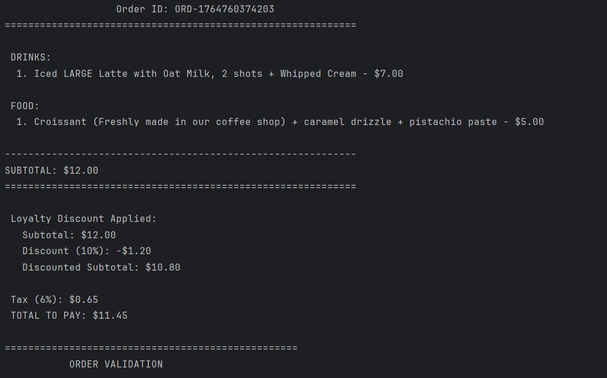
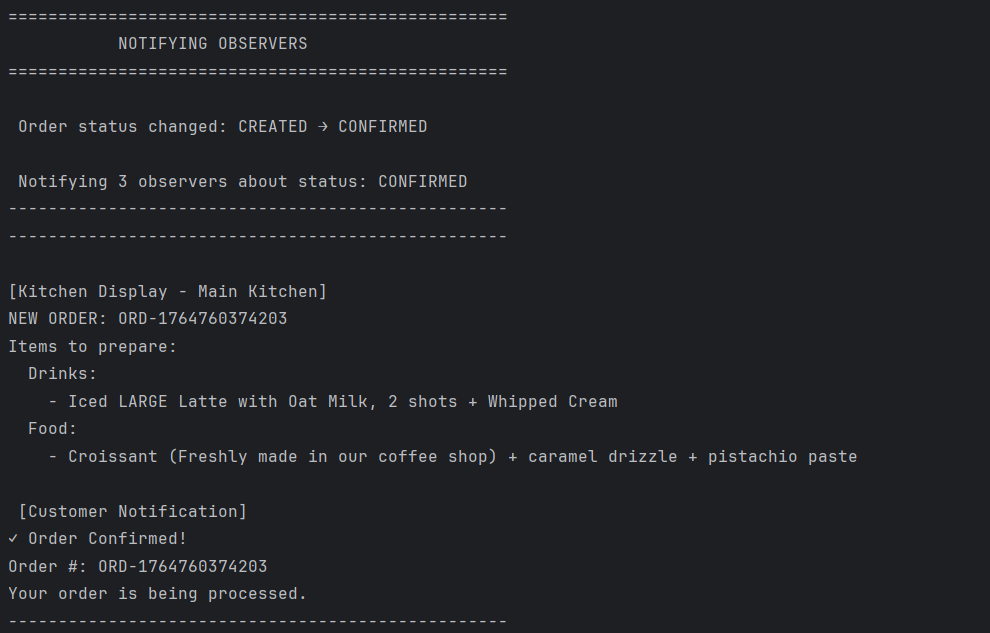
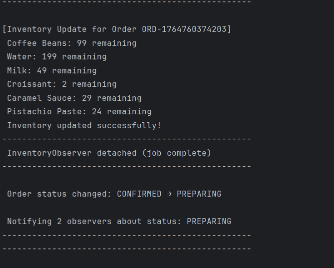

# Behavioral Design Patterns, Local Bistro 🥐☕

## Author: Condrea Loredana, Group FAF-231

----

## Objectives
1. Gain an in-depth understanding of Behavioral Design Patterns.
2. Extend the existing coffee shop system by introducing new user-focused functionalities.
3. Implement three behavioral patterns to improve workflow, decision-making, and communication between system components.

## Used Design Patterns

Behavioral Design Patterns focus on how objects interact, share information, and divide responsibility. These patterns help organize complex logic, reduce coupling, and make system behavior easier to reason about.

Patterns implemented in this lab:

- **Chain of Responsibility** – Sends a request through a sequence of handlers, each responsible for a specific validation step, allowing processing to be flexible and easily extendable.
- **Strategy** – Defines multiple algorithms for performing a task (in this case, payment processing), which can be swapped at runtime without altering client code.
- **Observer** – Establishes a one-to-many notification mechanism so multiple objects receive automatic updates whenever the subject changes state.

------------------------------------------------------------

## Implementation Overview

This laboratory work extends the coffee shop ordering system by implementing order validation, payment processing, and order status notifications using three behavioral design patterns. The system now validates orders before payment, supports multiple payment methods, and notifies relevant parties about order status changes.These behaviors are implemented using Chain of Responsibility, Strategy, and Observer.


### Chain of Responsibility

The **Chain of Responsibility** pattern implements a validation pipeline where each handler validates a specific aspect of the order before passing it to the next handler. The chain is established in `OrderFacade` and executed before payment processing.

```java
private void setupValidationChain() {
    OrderValidationHandler emptyOrderHandler = new EmptyOrderHandler();
    OrderValidationHandler workingHoursHandler = new WorkingHoursHandler();
    OrderValidationHandler stockHandler = new StockAvailabilityHandler();
    OrderValidationHandler minimumOrderHandler = new MinimumOrderHandler();

    emptyOrderHandler.setNext(workingHoursHandler);
    workingHoursHandler.setNext(stockHandler);
    stockHandler.setNext(minimumOrderHandler);

    validationChain = emptyOrderHandler;
}
```

The validation chain consists of four handlers:

1. **EmptyOrderHandler** – Rejects orders with zero items
2. **WorkingHoursHandler** – Ensures the shop is open
3. **StockAvailabilityHandler** – Checks inventory for all items
4. **MinimumOrderHandler** – Validates that the order total meets the minimum price requirement

Each handler implements the `OrderValidationHandler` abstract class:

```java
public abstract class OrderValidationHandler {
    protected OrderValidationHandler nextHandler;
    private final String handlerName;

    public void setNext(OrderValidationHandler next) {
        this.nextHandler = next;
    }

    public boolean validate(Order order) {
        if (!doValidation(order)) {
            return false;
        }
        return nextHandler == null || nextHandler.validate(order);
    }

    protected abstract boolean doValidation(Order order);
}
```

The moment one handler fails, the whole process stops. Payment is only allowed if the validation chain succeeds from start to finish.
### Strategy

The **Strategy** pattern encapsulates different payment methods (cash, card, mobile) into interchangeable strategy objects. Each payment strategy implements the `PaymentStrategy` interface:

```java
public interface PaymentStrategy {
    boolean processPayment(double amount);
    String getPaymentReceipt(double amount);
    String getPaymentMethodName();
}
```

The system includes three interchangeable strategies:

**CashPaymentStrategy** – Verifies cash provided and returns change

**CardPaymentStrategy** – Checks card information and approval status

**MobilePaymentStrategy** – Simulates digital wallet services (Google Pay, Apple Pay, etc.)

The user selects their preferred method at checkout, and the system executes the corresponding strategy.
### Observer

The **Observer** pattern notifies interested parties (observers) when an order's status changes. The `OrderSubject` maintains a list of observers and notifies them of status updates:

```java
public class OrderSubject {
    private List<OrderStatusObserver> observers;
    private String status;

    public void attach(OrderStatusObserver observer) {
        observers.add(observer);
    }

    public void setStatus(String status, Order order) {
        this.status = status;
        System.out.println("Order status changed: " + status);
        notifyObservers(order);
    }

    private void notifyObservers(Order order) {
        List<OrderStatusObserver> observersCopy = new ArrayList<>(observers);
        for (OrderStatusObserver observer : observersCopy) {
            observer.update(status, order);
        }
    }
}
```

All observers implement the `OrderStatusObserver` interface:

```java
public interface OrderStatusObserver {
    void update(String status, Order order);
}
```

Three observers are implemented:

**KitchenDisplayObserver** - Displays order information on the kitchen screen:

```java
public class KitchenDisplayObserver implements OrderStatusObserver {
    @Override
    public void update(String status, Order order) {
        switch (status) {
            case "CONFIRMED":
                System.out.println(" NEW ORDER RECEIVED: #" + order.getOrderId());
                displayOrderDetails(order);
                break;
            case "PREPARING":
                System.out.println(" Preparing order #" + order.getOrderId());
                break;
            case "READY":
                System.out.println(" Order READY for pickup!");
                break;
        }
    }
}
```

**CustomerNotificationObserver** - Sends notifications to the customer:

```java
public class CustomerNotificationObserver implements OrderStatusObserver {
    @Override
    public void update(String status, Order order) {
        switch (status) {
            case "CONFIRMED":
                notifyOrderConfirmed(order);
                break;
            case "PREPARING":
                notifyOrderPreparing(order);
                break;
            case "READY":
                notifyOrderReady(order);
                break;
            case "COMPLETED":
                notifyOrderCompleted(order);
                break;
        }
    }
}
```

**InventoryObserver** - Decreases stock when an order is confirmed and then detaches itself
```java
public class InventoryObserver implements OrderStatusObserver {
    private OrderSubject subject;

    @Override
    public void update(String status, Order order) {
        if (status.equals("CONFIRMED")) {
            System.out.println("-".repeat(50));
            updateInventory(order);
            System.out.println("-".repeat(50));

            // Detach after updating inventory - no longer needed
            subject.detach(this);
            System.out.println(" InventoryObserver detached (job complete)");
        }
    }
}
```

### Pattern Integration

The three behavioral patterns work together seamlessly:

1. **User proceeds to checkout** -> `validateOrder()` is called
2. **Chain of Responsibility validates** the order (empty, hours, stock, minimum)
3. **If validation passes** -> User selects payment method
4. **Strategy pattern processes** payment (Cash/Card/Mobile)
5. **If payment succeeds** -> **Observer pattern notifies** all interested parties
6. **InventoryObserver** updates stock and detaches itself
7. **Other observers** continue receiving PREPARING -> READY -> COMPLETED notifications

## Results

### Validation Phase

When the user checks out and the order is complete, the full validation chain is executed:


### Payment Processing with Strategy

The user then chooses a payment method—here, card was selected and here are the results:


### Observer Notifications

After successful payment, the Observer pattern notifies all interested parties:






The InventoryObserver detaches itself after the CONFIRMED update, while the kitchen and customer observers continue receiving status notifications.


## Conclusions
This laboratory work expands the coffee shop system with behavior-oriented functionalities using three key design patterns.

**The Chain of Responsibility** pattern creates a modular and scalable validation pipeline. Validation rules can be added or removed with ease, keeping the system flexible and clean.

**The Strategy** pattern decouples payment logic from the main program, allowing multiple payment methods without cluttering the codebase with conditional logic. Adding new payment types becomes trivial.

**The Observer** pattern establishes an automated event-notification system, ensuring that all parties are kept informed in real time. The ability for observers to dynamically detach (such as InventoryObserver) demonstrates advanced pattern usage.

Together with the previously built creational and structural patterns, these behavioral patterns contribute to a cohesive, extensible, and well-architected software solution that follows SOLID principles and supports future growth.
